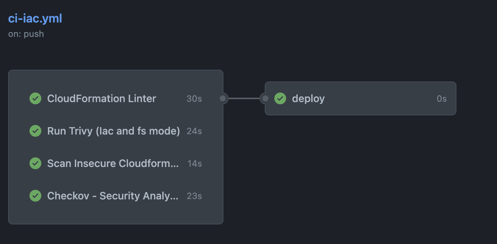

# Vulnerabilities Scanner Workshop

This an step by step workshop of how to implement Vulnerabilities Scanning in your code. Workshop steps are [HERE](workshop-steps.md)

## Infrastructure as a Code

- [Cloudformation Linter](https://github.com/marketplace/actions/cfn-lint-action)
  - Validate CloudFormation yaml/json templates against the CloudFormation spec and additional checks. Includes checking valid values for resource properties and best practices.
- [stelligent/cfn_nag](https://github.com/stelligent/cfn_nag):
  - The cfn-nag tool looks for patterns in CloudFormation templates that may indicate insecure infrastructure. Roughly speaking, it will look for:
    - IAM rules that are too permissive (wildcards)
    - Security group rules that are too permissive (wildcards)
    - Access logs that aren't enabled
    - Encryption that isn't enabled
    - Password literals

- [bridgecrewio/checkov-action](https://github.com/bridgecrewio/checkov-action)
  - This GitHub Action runs [Checkov](https://github.com/bridgecrewio/checkov) against an Infrastructure-as-Code repository. Checkov performs static security analysis of Terraform & CloudFormation Infrastructure code .

## Security Scanning for Application Code

- [gitleaks](https://github.com/zricethezav/gitleaks)
  - Gitleaks is a SAST tool for detecting and preventing hardcoded secrets like passwords, api keys, and tokens in git repos. Gitleaks is an easy-to-use, all-in-one solution for detecting secrets, past or present, in your code.
- [Grype](https://github.com/marketplace/actions/anchore-container-scan) (Anchore) Project and Docker Scan
  - This is a GitHub Action for invoking the [Grype](https://github.com/anchore/grype) scanner and returning the vulnerabilities found, and optionally fail if a vulnerability is found with a configurable severity level.

- [Pycharm-security](https://pycharm-security.readthedocs.io/en/latest/github.html) check
  - The plugin looks at your Python code for common security vulnerabilities and suggests fixes.
- [Trivy](https://github.com/marketplace/actions/aqua-security-trivy) Vulnerability Scanning
  - Trivy has different scanners that look for different security issues, and different targets where it can find those issues.
  - Targets:

    - Container Image
    - Filesystem
    - Git repository (remote)
    - Kubernetes cluster or resource
  - Scanners:
    - OS packages and software dependencies in use (SBOM)
    - Known vulnerabilities (CVEs)
    - IaC misconfigurations
    - Sensitive information and secrets

## Workshop

In this workshop you are going to learn how to implement security and vulnerabilities scanning in your code by using already available Github Actions on your GA Workflows.
The idea of this workshop is to follow the steps defined in this document at your own pace and using free tools.
We will try to cover vulnerabilities scanning for the application code (a Python Lambda function) and for the Infrastructure as Code (Cloudformation, docker)

We are going to create two pipelines, one for the application code and one for the IaC:

- The pipeline for the application code would look like:

- The pipeline for the Infrastructure as Code would look like:

